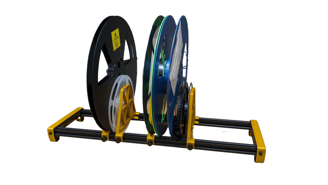

# LumenPnP Spool Holder

This repo contains a floor-mounted SMT component spool holder for desktop pick and place machines. It's designed to support either 7inch or 13inch spools, and has separators that are easily added, removed, or adjusted with a single thumbscrew.

## BOM

| Item | Quantity |
| ---- | -------- |
| Leg 3D Print (in `cad` folder) | 2 |
| Separator 3D Print (in `cad` folder) | 4 |
| [600mm 20x20 Aluminum Extrusion](https://www.amazon.com/BELLA-BAYS-Extrusion-20mmx20mm-Engraving/dp/B08XXL8ZQ4/) | 2 |
| [M5 T-Slot Nut](https://www.amazon.com/Fastener-Nickel-Plated-Sliding-Aluminum-Profile/dp/B086MKNYDS/) | 8 |
| [M5x10mm Socket Head Bolt](https://www.mcmaster.com/91290A224/) | 4 |
| [M5x10mm Thumbscrew](https://www.amazon.com/gp/product/B07KFV6HW8) | 4 |
